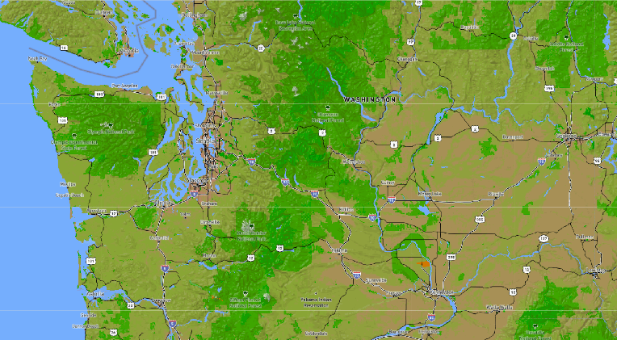
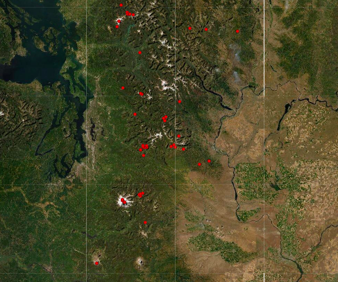
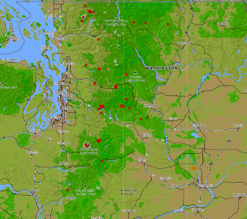
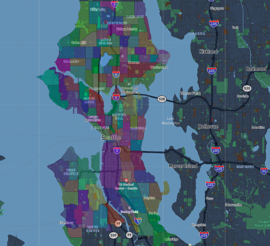

# Map-Tile-Generation
Thomas Kakatsakis
Lab 4 for course Geography 458 at the University of Washington

I have created four tiled layers using Mapbox, QMetaTiles and QGIS. I describe each layer below:

# Tile 1 - Outdoors Basemap

- Description of Tile: Modified and simplified basemap, putting an emphasis on public land and green spaces. Removes unncessary details in inhabited areas, and provides discrepencies for land type and topographic lines in non-inhabited areas. Intended for use with outdoors minded datasest.
- Geographic Area of Focus: Washington state

## Tile 2 - Avalanche Fatalities Sites

- Description of Tile: Points at the location of every recorded avalanche fatality in Washington state history. Lat and Lon values derived from Northwest Avalanche Center when available, or estimated based on news reports and accident descriptions. Compiled by me, as part of a larger research project considering backcountry recreation in Washington state.
- Geographic Area of Focus: Washington state.

## Tile 1 Screenshot - Avalanche with Basemap

- Description of Tile: A combination of the two layers described above. The location of avalanche fatalities display over a custom, outdoor focused basemap.
- Geographic Area of Focus: Washington state.

## Tile 1 Screenshot - Modified Basemap

- Description of Tile: Seattle Census Tracts, overlaid with a custom basemap. Intended for visualization of the census tracts of the city, with assorted colors to distinguish individual tracts and a customized basemap which highlights notable features including hospitals, schools and parks.
- Geographic Area of Focus: Seattle, Washington
